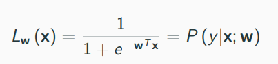
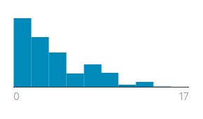
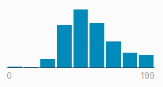
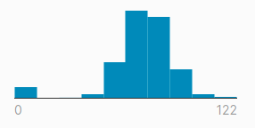
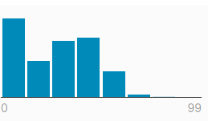
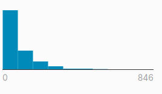
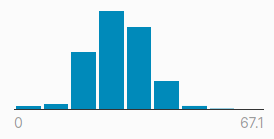
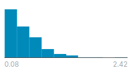
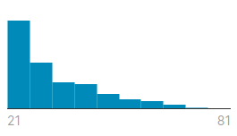

# Logistic Classification Practice
This repo is used for a Logistic Classification Practice

## Credits
Profesor: Dr. Andrés Hernández Gutiérrez

Student: Alan Rocha

## About Logistic Classification
The objective of the logistic classification is to determine whether or not an object x belongs to a class. To determine this, object x has multiple characteristics that help a model determine its class.

In order to evaluate the object x, it must be evaluated with a hypothesis function, very similar as linear or multivariate regression. However, the hypothesis function must be changed, which must be:

## About the data set Diabetes Prediction

This dataset is originally from the National Institute of Diabetes and Digestive and Kidney Diseases. The objective of the dataset is to diagnostically predict whether or not a patient has diabetes, based on certain diagnostic measurements included in the dataset. Several constraints were placed on the selection of these instances from a larger database. In particular, all patients here are females at least 21 years old of Pima Indian heritage. (_Pima Indians Diabetes Database, 2016_)

### Characteristics

Characteristics | Histogram | 
--- | --- |
Pregnancies (_Number of times pregnant_) |  |
Glucose (_Plasma glucose concentration a 2 hours in an oral glucose tolerance test_) |  |
BloodPressure (_Diastolic blood pressure (mm Hg)_)|  |
SkinThickness (_Triceps skin fold thickness (mm)_) |  |
Insulin (_2-Hour serum insulin (mu U/ml)_) |  |
BMI (_Body mass index (weight in kg/(height in m)^2)_) |  |
DiabetesPedigreeFunction (_Diabetes pedigree function_) |  |
Age (_In years_) |  |

## Discussion

### Data set
There are some features that may be not applicable. For example, I don't know how much the Pregnancies feature can contribute to the model. Excessive features are likely cause that the generated model may not be as precise and accurate as it could be. Since the dataset has a lot of features, the data set should be scaled in order to improve time performance.

### Results
The data is shuffled each time the program is executed, so it was decided to make a table with the variables of confusion matrix, running the program 10 times. These data were made with a learning rate of 0.005 and stopping criteria of 0.01.

C.M.V | 1 | 2 | 3 | 4 | 5 | 6 | 7 | 8 | 9 | 10 | Avg. |
--- | --- | --- | --- | --- | --- | --- | --- | --- | --- | --- | --- |
TP | 24 | 20 | 31	| 31 | 28	| 39 | 37	| 37 | 29 | 37 | 31.3 |
TN | 82 | 102 | 85 | 93 | 83 | 81 | 86 | 86 | 84 | 83 | 86.5 |
FP | 10 | 8 | 11 | 13 | 13 | 14 | 10 | 11 | 17 | 10 | 11.7 |
FN | 37 | 23 | 26 | 16 | 29 | 19 | 20 | 19 | 23 | 23 | 23.5 |

Metric | Accuracy | Precision | Recall | Specificity | F1 score |
--- | --- | --- | --- | --- | --- |
Average | 0,76993 | 0,72791 | 0,57117 | 0,88086 | 0,64008 |

### Conclusion
In conclusion, the model is far from being precise and exact. The main problem is that there are too many false negatives. This may be caused by features that are not necessary or not as relevant in the model.

## References
Pima Indians Diabetes Database. (2016, October 6). Retrieved from [kaggle website](https://www.kaggle.com/uciml/pima-indians-diabetes-database)